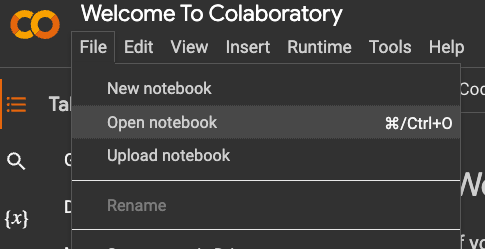
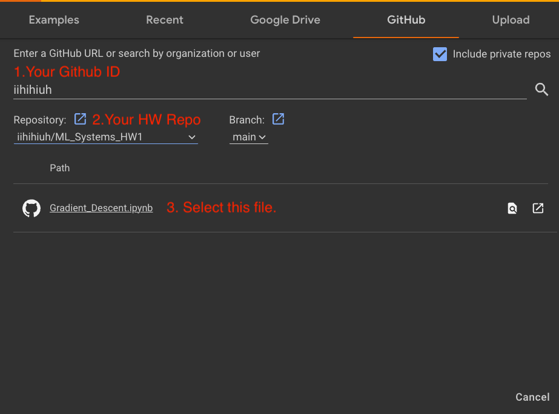
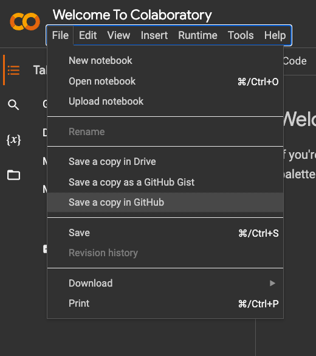
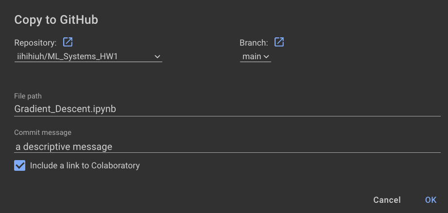

# HW1 EE599 Systems for Machine Learning, Fall 2023
## University of Southern California
## Instructors: Arash Saifhashemi, Murali Annavaram

---
## Setup Your Browser
Please make sure that you create a separate browser profile that only has your USC Google account. Otherwise, some of the code might fail due to authorization issues.

## Setup Google Drive
- Login your Google Drive using your **usc email**.
- In **My Drive** create a folder **UtilFolder**.
- Upload [utils.py](utils.py) in this repository to the created **UtilFolder**.

## Open & Save `.ipynb` files in Google Colab
- Open [Google Colab](https://colab.research.google.com/).
- Login using your USC Google Account.
- Click File -> Open Notebook.

- Click on Github Sub-tab in the pop-up window, and check the "include private repos" box.

Note that due to Google implementation, you cannot save your notebooks using auto-save or Control-S. You must save using File -> Save a copy in Github.

---

## TODO: 
- Please clone this repository. Answser the questions in all Google Colab files (with extension `.ipynb`) and check them in.
- Due date: Aug 30th, 2023

# Resources
* [Get Started with Google Colaboratory](https://youtu.be/inN8seMm7UI)
* [Google Colab: Basic Features Overview](https://colab.research.google.com/notebooks/basic_features_overview.ipynb)
* [Uploading and Saving GitHub Notebooks](https://colab.research.google.com/github/googlecolab/colabtools/blob/master/notebooks/colab-github-demo.ipynb)
